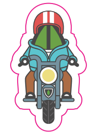

# Getting MEAN
## An Introduction to API-Centered Application Development with Node.js and MongoDB
## Quest 5: Defining the data for our application
  
Our hero, Leafie, is on the quest for a great Hero sandwich here in New York. Let's provide him with some options for 
places to eat. Let's define some restaurants in a `data.js` file:

```javascript {.line-numbers}
module.exports = {
    margon: {
        "name": "Margon",
        "rest_id": "1",
        "street": "136 W 46th",
        "district": "Theater",
        "city": "New York",
        "state": "NY",
        "postal_code": 10036,
        "specialty": "Cubano"
    },
    melt_shop: {
        "name": "Melt Shop",
        "rest_id": "2",
        "street": "135 W 50th",
        "district": "Theater",
        "city": "New York",
        "state": "NY",
        "postal_code": 10020,
        "specialty": "Truffle Grilled Cheese"
    },
    piccolo: {
        "name": "Piccolo Cafe",
        "rest_id": "3",
        "street": "274 W 40th ST",
        "district": "Theater",
        "city": "New York",
        "state": "NY",
        "postal_code": 10018,
        "specialty": "Streak Panini"
    },
    toasties: {
        "name": "Toasties",
        "rest_id": "4",
        "street": "148 W 49th",
        "district": "Theater",
        "city": "New York",
        "state": "NY",
        "postal_code": 10019,
        "specialty": "Spicy Roast Beef"
    }, 
    juniors: {
        "name": "Junior's Restaurant & Bakery",
        "rest_id": "5",
        "street": "1515 Broadway",
        "district": "Theater",
        "city": "New York",
        "state": "NY",
        "postal_code": 10036,
        "specialty": "Chicken Deluxe Sandwich"
    },
    secondAve: {
        "name": "Second Avenue Deli",
        "rest_id": "6",
        "street": "162 E 33rd St",
        "district": "Theater",
        "city": "New York",
        "state": "NY",
        "postal_code": 10016,
        "specialty": "Pastrami Sandwich"
    },
    katz: {
        "name": "Katz's Delicatessen",
        "rest_id": "7",
        "street": "205 E Houston ST",
        "district": "Theater",
        "city": "New York",
        "state": "NY",
        "postal_code": 10002,
        "specialty": "Corned Beef Sandwich"
    },
    bens:  {
        "name": "Ben's Kosher Delicatessen",
        "rest_id": "8",
        "street": "209 W 38th ST",
        "district": "Theater",
        "city": "New York",
        "state": "NY",
        "postal_code": 10018,
        "specialty": "Matso Ball Soup"
    },
    eisenbergs: {
        "name": "Eisenberg's Sandwich Shop",
        "rest_id": "9",
        "street": "174 5th Ave",
        "district": "Flatiron",
        "city": "New York",
        "state": "NY",
        "postal_code": 10010,
        "specialty": "Reuben Sandwich"
    }
};
```

## Weapons, Tools and Resources

## Concepts

## Helpful Hints

## You are Here - Quests
|  | Quest | Description |
|--|-------|-------------|
|  |[Quest Zero](./quest0.md) | First quest to read.  Provides some overview information and background. |
|  |[Quest 1](./quest1.md) | Initialize your project and install some of the required software. |
|  |[Quest 2 ](./quest2.md) | creating a quick test JavaScript. |
|  |[Quest 3 ](./quest3.md) | Crafting your own tools: Building a server process using `httpd` and `express` |
|  |[Quest 4 ](./quest4.md) | Building Your App |
| > |Quest 5 | Defining the data for our application |
|  |[Quest 6 ](./quest6.md) | Enter MongoDB - Native JavaScript  |
|  |[Quest 7](./quest7.md) | Creating and Reading data using the Native MongoDB Driver |
| | [Quest 8](./quest8.md) | Mongoose - Object Data Modeling |
| | [Quest 9](./quest9.md) | Creating and Reading data using Mongoose  |

## Next Quest

Next quest: [Quest 6 - Enter MongoDB - Native JavaScript ](./quest6.md)
