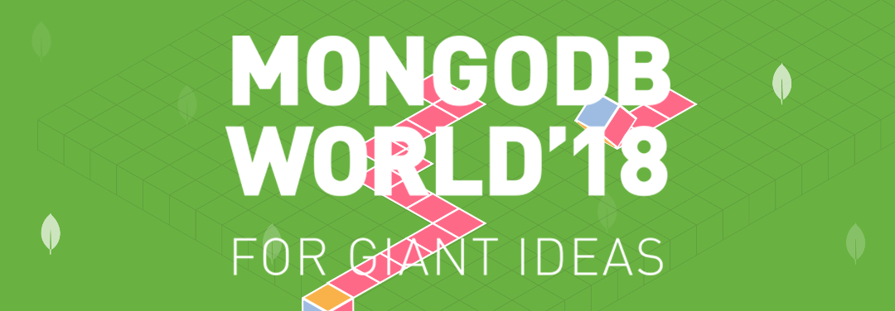

# Getting MEAN
## An Introduction to API-Centered Application Development with Node.js and MongoDB
## Quest 6: Enter MongoDB - Native JavaScript
Leafie wants to keep all of the information in a MongoDB database. First off we need to setup a connection
to our MongoDB database. The basic steps to connect with the database are:

+ Use `MongoClient` to establish a connection
+ Pass in the url to connect to. In our case it will be `localhost` with the default port of `27017`.
+ Select the database to which to connect to. 

Let's add MongoDB to our Node.js project:

```
npm install --save mongodb
```

In the `api/data` folder, let's create a new file called `db.js`.

```javascript {.line-numbers}
let MongoClient = require('mongodb').MongoClient;


const dbName = 'mdbw18';
const mdbPort = 27017;
const url = 'mongodb://localhost:' + mdbPort + '/' + dbName;

class Connection {
    constructor(uri, name) {
        this.db = null;
        this.uri = uri;
        this.name = name;
    }

    connect() {
        if(this.db) {
            return Promise.resolve(this.db);
        } else {
            return MongoClient.connect(this.uri)
                .then(client => {
                    this.db = client.db(this.name);
                    return this.db;
                });
        }
    }
}

module.exports = new Connection(url, dbName);
```

With a successful connection in place, next up is to put data **in** so we can get data **out** of the database. Hmmm, 
this sounds like a *CRUD*dy job. We'll need to do these CRUD operations inside a MongoDB connection... 

Let's make a quick `db_populate.js` file that will initalize our MongoDB database with some of our delis.

```javascript {.line-numbers}
const db = require('./db.js');
const data = require('./delis.js);

db.connect().then(function (db) {
    db.collection('delis')
        .insertMany([
            data.margon,
            data.juniors,
            data.melt_shop,
            data.piccolo,
            data.toasties
        ],
        function (err, r) {
            console.log("Database setup with delis.");
            process.exit(0);
        });
});
```

Now from the terminal we can run `node api/data/db_populate.js` to populate our database. And if we look at our
database in Compass, there's our data. Leafie is feeling very heroic, and so should you!

## Weapons, Tools and Resources
+ MongoDB [Compass](https://www.mongodb.com/download-center#compass) - A GUI interface for MongoDB exploration

## Concepts

## Helpful Hints

## You are Here - Quests
|  | Quest | Description |
|--|-------|-------------|
|  |[Quest Zero](./quest0.md) | First quest to read.  Provides some overview information and background. |
|  |[Quest 1](./quest1.md) | Initialize your project and install some of the required software. |
|  |[Quest 2 ](./quest2.md) | creating a quick test JavaScript. |
|  |[Quest 3 ](./quest3.md) | Crafting your own tools: Building a server process using `httpd` and `express` |
|  |[Quest 4 ](./quest4.md) | Building Your App |
|  |[Quest 5](./quest5.md) | Defining the data for our application |
| > |Quest 6 | Enter MongoDB - Native JavaScript  |
|  |[Quest 7](./quest7.md) | Creating and Reading data using the Native MongoDB Driver |
| | [Quest 8](./quest8.md) | Mongoose - Object Data Modeling |
| | [Quest 9](./quest9.md) | Creating and Reading data using Mongoose  |

## Next Quest

Next quest: [Quest 7 - Creating and Reading data using the Native MongoDB Driver ](./quest7.md) 
